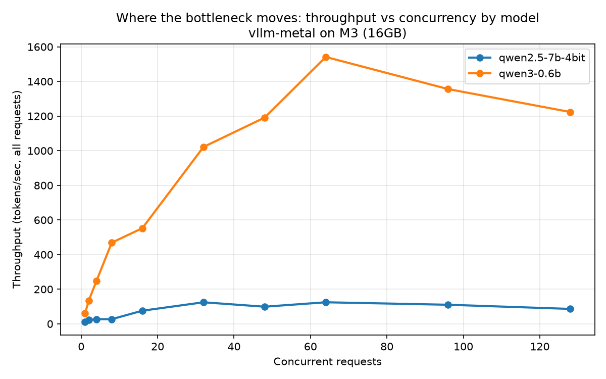

# Benchmarking vLLM on Apple Silicon

I measured how [vLLM](https://github.com/vllm-project/vllm)'s serving stack behaves on an
Apple M3 (16GB) using the [`vllm-metal`](https://github.com/vllm-project/vllm-metal) plugin,
which runs vLLM's scheduler, paged KV cache, and OpenAI-compatible server on Apple's GPU via MLX/Metal.

The goal was to see the mechanisms that make vLLM fast — **continuous batching** and
**prefix caching** — actually happen and measure them on consumer hardware rather than an NVIDIA
datacenter GPU, and to see how the picture changes across a 12x range of model size.

**Setup:** vLLM core v0.30.0 via vllm-metal, macOS on Apple Silicon (M3, 16GB unified memory).
Models: Qwen3-0.6B and Qwen2.5-7B (4-bit). All requests use pinned sampling (`temperature=0`)
and Qwen3's `/no_think` mode so token counts are comparable across runs. Latency metrics come from
streaming responses (TTFT = time to first token; TPOT = time per output token, i.e. decode speed).

---

## Finding 1: Throughput scales with concurrency — then degrades

Continuous batching lets the GPU serve many requests in one forward pass. Sweeping concurrency for
Qwen3-0.6B, total throughput climbed steeply, peaked around 64 concurrent requests, then **fell**:


| Concurrent requests | Throughput (tok/s) | TTFT (ms) | TPOT (ms) |
|--:|--:|--:|--:|
| 1 | 60 | 138 | 15.3 |
| 8 | 483 | 90 | 15.8 |
| 16 | 538 | 139 | 28.6 |
| 32 | 1026 | 146 | 30.0 |
| **64** | **1480** | 372 | 39.8 |
| 128 | 1214 | 1902 | 62.4 |

- **~25x throughput gain** from 1 to 64 concurrent requests (60 → 1480 tok/s). At 1 request the GPU
  is mostly idle; batching fills it. The early climb is near-linear — going from 1 to 8 users gives
  roughly 8x the throughput.
- **Peak at 64, then regression at 128.** Past the peak the engine can't run all requests at once
  (server logs showed `Running: 100 reqs` at the 128 level), so requests **queue** — TTFT jumps to
  ~1.9s and total throughput actually *drops*. More concurrency past saturation buys nothing.
- **Compute-bound, not memory-bound (for this small model).** KV cache usage never exceeded ~16% even
  at peak. A 0.6B model on 16GB of unified memory hits a compute ceiling long before a memory one.


The latency view shows the tradeoff: TTFT and TPOT stay flat while throughput climbs cheaply (up to
~8 concurrent), then rise sharply past the saturation point. Below the knee, concurrency is nearly
free; above it, you pay latency for throughput.

## Finding 2: Prefix caching gives 5.3x faster time-to-first-token

When requests share a long prefix (e.g. a common system prompt), vLLM reuses the cached prefix's KV
blocks instead of recomputing them. Controlled A/B: **shared-prefix** requests (can reuse the cache)
vs **unique-prefix** requests (can't), run with the server's prefix caching on and then off.

| Server setting | Shared TTFT | Unique TTFT | Ratio |
|---|--:|--:|--:|
| Prefix caching **ON** (default) | 43.3 ms | 231.4 ms | **5.34x** |
| Prefix caching **OFF** (control) | 228.6 ms | 231.8 ms | 1.01x |

- Reusing a shared prefix returned the first token **5.34x faster** (43ms vs 231ms) — the shared
  prefill work was skipped.
- The **off control** collapses the gap to 1.01x, proving the speedup is caused by prefix caching and
  nothing else (e.g. not prompt-length differences). This is the difference between *observing* an
  effect and *isolating* its cause.
- In the raw data the first shared request takes ~700ms (cold: it populates the cache), then every
  subsequent one drops to ~42ms (warm hit) — the mechanism visible in a single column of numbers.
- The "full prefill" cost was a consistent ~230ms across every other condition; only the cached case
  broke from it.

## Finding 3: Model size changes when the GPU saturates (and it's compute, not memory)

Running the same concurrency sweep on Qwen2.5-7B (4-bit) — a ~12x larger model — on the same laptop:



| | Qwen3-0.6B | Qwen2.5-7B-4bit |
|---|--:|--:|
| Peak throughput | ~1540 tok/s | ~125 tok/s |
| TPOT at 1 user | 14 ms | 67 ms |
| TTFT at 1 user | 252 ms | 1313 ms |
| Concurrency to reach peak | ~64 | ~32 |

- **~12x throughput gap** between the two models on identical hardware.
- The 7B is **compute-bound almost immediately**: each token takes ~5x longer to generate (67ms vs
  14ms TPOT) even at a single user, with no memory pressure at all, because there is 12x more model to
  push through per token. A handful of requests already saturate the GPU.
- **Verified it's compute, not memory.** Across the entire 7B sweep, `CPU KV cache usage` never
  exceeded ~11% (even with 100 requests running at once), and no requests ever queued for memory
  (`Waiting: 0`). Yet throughput plateaued around 125 tok/s. Memory was never the limit — the GPU's
  math throughput was. On an H100 the 7B would fly; on an M3 it saturates from the first request.
- So the small model only became compute-bound once ~64 requests were stacked up; the large model is
  compute-bound from the first request. The *amount of concurrency needed to saturate the GPU*
  collapses as the model grows.

---

## What I took away

- **Continuous batching's value is real but bounded** — there's a sweet spot (here, ~64 concurrent
  requests for the small model), and pushing past it trades throughput for queueing latency.
- **What saturates the GPU depends on model size** — a tiny model needs heavy concurrency to hit the
  compute wall; a large model hits it almost immediately, because per-token compute dominates. And on
  this hardware the wall was always *compute*, not memory (KV cache stayed under ~16% throughout).
- **Prefix caching is a large, cheap win** for workloads with shared prompts (5.3x faster first token
  here), and it's on by default in vllm-metal.
- **Apple's unified memory changes the usual intuition** — coming from the NVIDIA "not enough VRAM"
  world, I expected 16GB to be the binding constraint. For these models it never was; compute was.

## Files

| File | What it does |
|---|---|
| `benchmark.py` | Concurrency sweep for one model → `results/01_batching.json` (Finding 1) |
| `plots.py` | Throughput and latency graphs from the sweep |
| `prefix_cache_experiment.py` | Shared-vs-unique-prefix A/B → `results/02_prefix_cache_*.json` (Finding 2) |
| `benchmark_models.py` | Concurrency sweep for a named model → `results/03_model_*.json` (Finding 3) |
| `plot_models.py` | Overlays multiple models' throughput curves |

## Running it yourself

```bash
# 1. install vllm-metal (Apple Silicon, arm64 Python 3.12)
curl -fsSL https://raw.githubusercontent.com/vllm-project/vllm-metal/main/install.sh | bash
source ~/.venv-vllm-metal/bin/activate
pip install aiohttp matplotlib

# 2. start the server (terminal 1)
vllm serve Qwen/Qwen3-0.6B --max-model-len 2048

# 3. run the experiments (terminal 2, from inside this folder)
ulimit -n 8192

# Finding 1: concurrency sweep + graphs
python benchmark.py
python plots.py

# Finding 2: prefix caching (run once caching-on, then restart server
# with --no-enable-prefix-caching and run again)
python prefix_cache_experiment.py on
python prefix_cache_experiment.py off

# Finding 3: model comparison (one model per server session)
python benchmark_models.py qwen3-0.6b
# restart server with: vllm serve mlx-community/Qwen2.5-7B-Instruct-4bit --max-model-len 1024
python benchmark_models.py qwen2.5-7b-4bit
python plot_models.py
```

*Numbers are from an M3 16GB and are meant to show the shape of the curves, not absolute peak
performance. The value is in the behaviors — batching scaling, the saturation turnover, prefix-cache
speedup, and the compute-vs-memory bottleneck — which hold regardless of hardware.*
