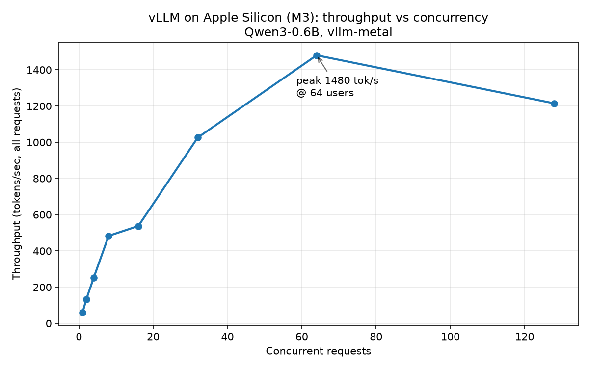
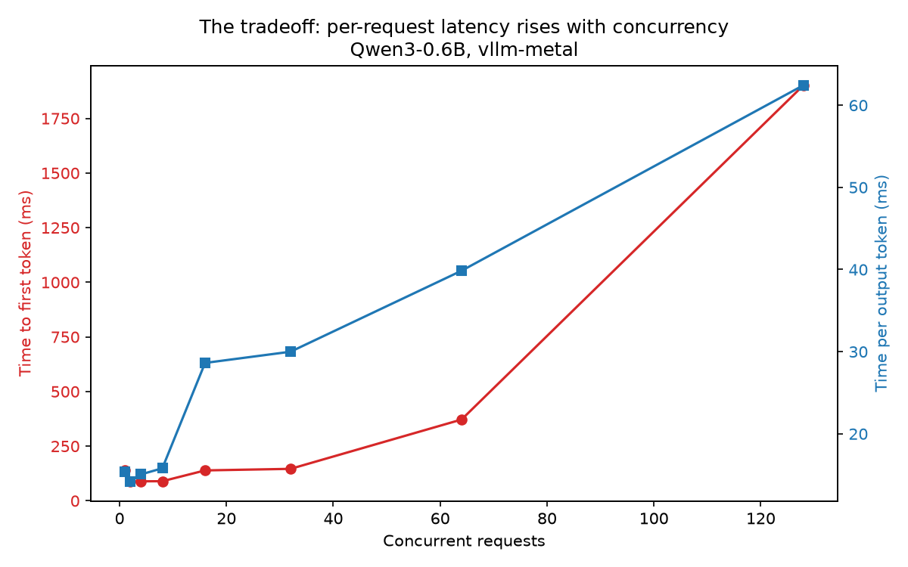

# Benchmarking vLLM on Apple Silicon

I measured how [vLLM](https://github.com/vllm-project/vllm)'s serving stack behaves on an
Apple M3 (16GB) using the [`vllm-metal`](https://github.com/vllm-project/vllm-metal) plugin,
which runs vLLM's scheduler, paged KV cache, and OpenAI-compatible server on Apple's GPU via MLX/Metal.

The goal was to see the two mechanisms that make vLLM fast — **continuous batching** and
**prefix caching** — actually happen, and measure them, on consumer hardware rather than an NVIDIA datacenter GPU.

**Setup:** Qwen3-0.6B, `max-model-len=2048`, vLLM core v0.30.0 via vllm-metal, macOS on Apple Silicon (M3, 16GB unified memory).

---

## Finding 1: Throughput scales with concurrency — then degrades

Continuous batching lets the GPU serve many requests in one forward pass. As I raised the
number of concurrent requests, total throughput climbed steeply, peaked, then **fell**:



| Concurrent requests | Throughput (tok/s) | TTFT (ms) | TPOT (ms) |
|--:|--:|--:|--:|
| 1 | 60 | 138 | 15.3 |
| 8 | 483 | 90 | 15.8 |
| 32 | 1026 | 146 | 30.0 |
| **64** | **1480** | 372 | 39.8 |
| 128 | 1214 | 1902 | 62.4 |

- **~25x throughput gain** from 1 to 64 concurrent requests (60 → 1480 tok/s). At 1 request the
  GPU is mostly idle; batching fills it.
- **Peak at 64, then regression at 128.** Past the peak, the engine can't run all requests at once
  (server logs showed `Running: 100 reqs` at the 128 level), so requests **queue** — TTFT jumps to
  ~1.9s and total throughput actually drops. More concurrency past saturation buys nothing.
- **Compute-bound, not memory-bound.** KV cache usage never exceeded ~16% even at peak load. On this
  hardware with a small model, you run out of *compute throughput* long before you run out of memory —
  a consequence of Apple's unified memory pool being large relative to the tiny model.



## Finding 2: Prefix caching gives 5.3x faster time-to-first-token

When many requests share a long prefix (e.g. a common system prompt), vLLM caches that prefix's KV
blocks and reuses them, skipping most of the prefill. I measured this with a controlled A/B:
**shared-prefix** requests (can reuse the cache) vs **unique-prefix** requests (can't).

| Server setting | Shared TTFT | Unique TTFT | Ratio |
|---|--:|--:|--:|
| Prefix caching **ON** (default) | 43.3 ms | 231.4 ms | **5.34x** |
| Prefix caching **OFF** (control) | 228.6 ms | 231.8 ms | 1.01x |

- With caching **on**, reusing a shared prefix returned the first token **5.34x faster** (43ms vs 231ms),
  because the shared prefill work was skipped.
- The **off control** collapses the gap to 1.01x — proving the speedup is caused by prefix caching and
  nothing else (e.g. not prompt-length differences).
- The "full prefill" cost was a consistent ~230ms across every condition; only the cached case broke from it.
  (In the raw data, the very first shared request takes ~700ms to populate the cache, then every
  subsequent one drops to ~42ms — cold-populate vs warm-hit, visible in a single column of numbers.)

---

## What I took away

- **Continuous batching's value is real but bounded** — there's a sweet spot (here, ~64 concurrent
  requests), and pushing past it trades throughput for queueing latency.
- **The bottleneck depends on the hardware/model ratio** — a small model on 16GB of unified memory is
  compute-bound, which flips the usual "not enough VRAM" assumption from the NVIDIA world.
- **Prefix caching is a large, cheap win** for any workload with shared prompts, and it's on by default
  in vllm-metal.

## Running it yourself

```bash
# 1. install vllm-metal (Apple Silicon, arm64 Python 3.12)
curl -fsSL https://raw.githubusercontent.com/vllm-project/vllm-metal/main/install.sh | bash
source ~/.venv-vllm-metal/bin/activate
pip install aiohttp matplotlib

# 2. start the server (terminal 1)
vllm serve Qwen/Qwen3-0.6B --max-model-len 2048

# 3. run the experiments (terminal 2, from inside this folder)
ulimit -n 8192
python benchmark.py                    # Finding 1: concurrency sweep
python plots.py                        # graphs
python prefix_cache_experiment.py on   # Finding 2: prefix caching (caching on)
# restart server with --no-enable-prefix-caching, then:
python prefix_cache_experiment.py off  # Finding 2: control
```

*Numbers are from an M3 16GB and are meant to show the shape of the curves, not absolute peak performance.*
